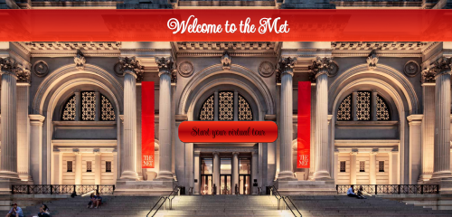

<h1 align="center">Hi 👋🏼, I'm Mary Rose</h1>
<!-- <h2 align="center">@ElektrazCode</h2> -->

- 💻 I’m a passionate Full-Stack Software Engineer at **100Devs**

- 💗 I love coding in **html, css, javascript, SQL & java**

- 👀 I’m interested in collaborating to open source projects 

- 🔭 I’m currently working on **Eye Clinic Website**

- 🤝🏼 I’m currently collaborating on **ICAF's Website**

- 🌱 I’m currently learning **Node, React & MangoDB**
     
- 📫 You can reach me at **ElektrazCode@gmail.com**

- <pre>⚡ I currently daily code on codewars    ⇨    </pre>

<h1>Projects</h1> 

<table>
    <tr>
        <td width="50%" valign= "top">
            
 
                  
                
                  
                
<b>Description:</b> Web-based app with prospective implementation as mobile app. <b>Main Objective:</b> Retrieves List of Drinks from API. It asks the user to enter a kind of liquor, retrieves cocktails from an api and displays a carousel of drinks for the user to browse through. Tools: this app is designed with html, css and javaScript with the integration of the Api: https://thecocktaildb.com/api and the library providing the Swiper Effect: Swiper.js
 
            

        </td>
        <td width="50%" valign= "top">
            
 
                  
                
                  
                
<b>Description:</b> Interactive Game. <b>Main Objective:</b> Find hidden Smurfs. If found Azrael, Gargamel's cat, 3 time, the smurfs will fall in Gargamel's hands. <b>Tools:</b> this app is designed with HTML, CSS, JavaScript.
 
            

        </td>
    </tr>
    <tr>
        <td width="50%" valign= "top">
            
 
                  
                
                  
                
<b>Description:</b> It's a fully responsive website. <b>Main Objective:</b> It showcases all of the art pieces currently displayed a the MET museum. Tools: It's designed with html, css and javascipt, running an api to retrieve info about artwork in the MET musuem.
 
            

        </td>
        <td width="50%" valign= "top">
            
 
                  
                
                  
                
<b>Description:</b> It's a fully responsive website. <b>Main Objective:</b> It displays some info about the Harry Potter movie retrieved and collected from different APIs: its books, characters, spells and potions. I am currently working on adding a game using the retrieved information. Tools: It is designed with Html, css & javascript. Retrieving info from the API: .
 
            

        </td>
    </tr>
</table>
<!-- 

 -->

<h1>Languages and Tools</h1> 

 
    <!--   -->
    
    
    
        
    
    
    
    
    
    <!-- 
     -->
    <!--  -->
    <!--  -->
    <!--  -->
    <!--  -->
    <!-- 
     -->
    <!-- 
     -->

<!--  -->
<!-- 
 -->

<h1>Stats</h1> 

  

<!-- 
  
 -->

  

<h1>Connect with me</h1> 

<!--  -->

